# Imagine

Renders images and movies

## Examples

### Images

<a href="Imagine.Tests/input/rgb.png" style="display: flex; align-items: center; gap: 10px; text-decoration: none;">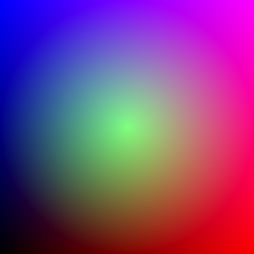rgb</a>

<a href="Imagine.Tests/input/hsv.png" style="display: flex; align-items: center; gap: 10px; text-decoration: none;">hsv</a>

<a href="Imagine.Tests/input/plane-horizontal-bounded.png" style="display: flex; align-items: center; gap: 10px; text-decoration: none;">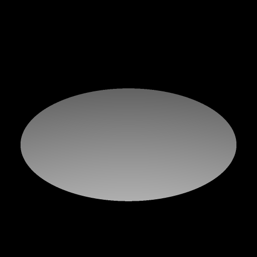plane-horizontal-bounded</a>

<a href="Imagine.Tests/input/tetrahedron-face-down.png" style="display: flex; align-items: center; gap: 10px; text-decoration: none;">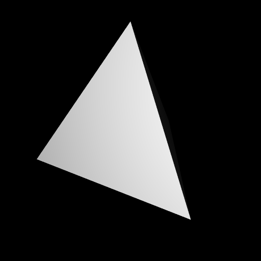tetrahedron-face-down</a>

<a href="Imagine.Tests/input/tetrahedron-vertex-down.png" style="display: flex; align-items: center; gap: 10px; text-decoration: none;">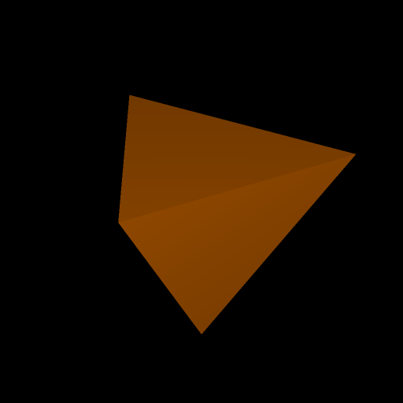tetrahedron-vertex-down</a>

<a href="Imagine.Tests/input/cube-face-down.png" style="display: flex; align-items: center; gap: 10px; text-decoration: none;">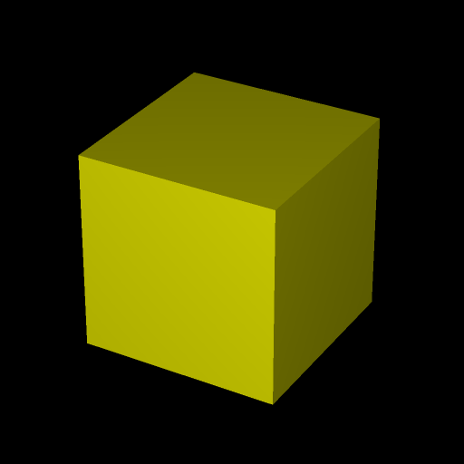cube-face-down</a>

<a href="Imagine.Tests/input/cube-vertex-down.png" style="display: flex; align-items: center; gap: 10px; text-decoration: none;">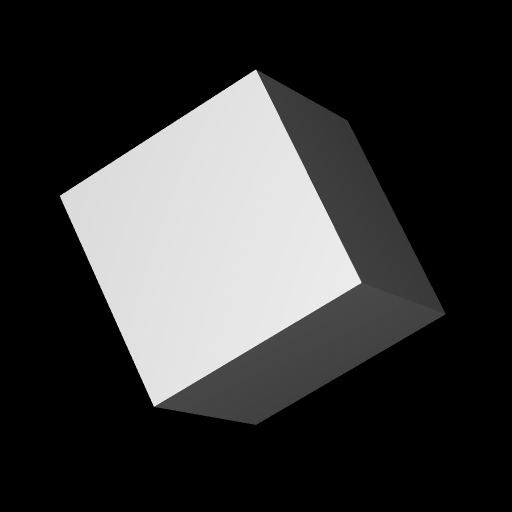cube-vertex-down</a>

<a href="Imagine.Tests/input/octahedron-face-down.png" style="display: flex; align-items: center; gap: 10px; text-decoration: none;">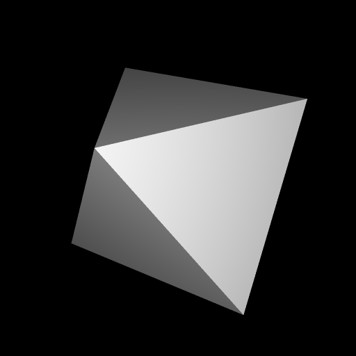octahedron-face-down</a>

<a href="Imagine.Tests/input/octahedron-vertex-down.png" style="display: flex; align-items: center; gap: 10px; text-decoration: none;">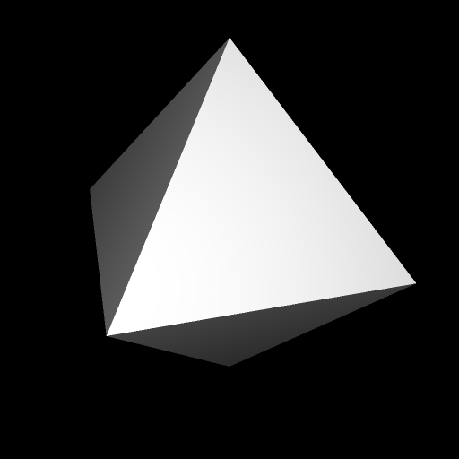octahedron-vertex-down</a>

<a href="Imagine.Tests/input/dodecahedron-face-down.png" style="display: flex; align-items: center; gap: 10px; text-decoration: none;">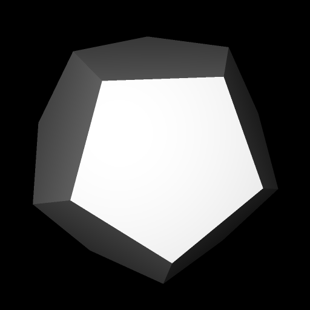dodecahedron-face-down</a>

<a href="Imagine.Tests/input/dodecahedron-vertex-down.png" style="display: flex; align-items: center; gap: 10px; text-decoration: none;">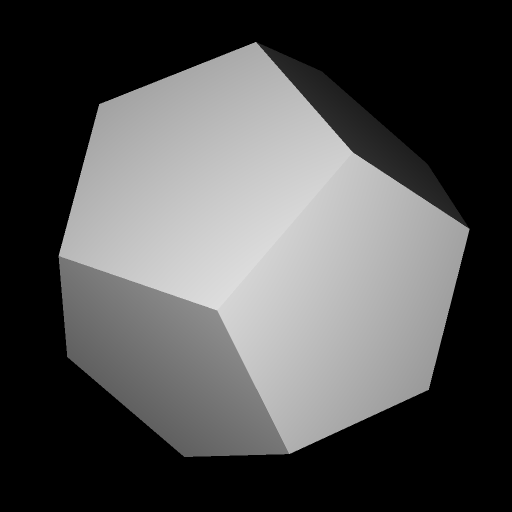dodecahedron-vertex-down</a>

<a href="Imagine.Tests/input/icosahedron-face-down.png" style="display: flex; align-items: center; gap: 10px; text-decoration: none;">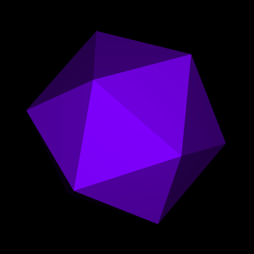icosahedron-face-down</a>

<a href="Imagine.Tests/input/icosahedron-vertex-down.png" style="display: flex; align-items: center; gap: 10px; text-decoration: none;">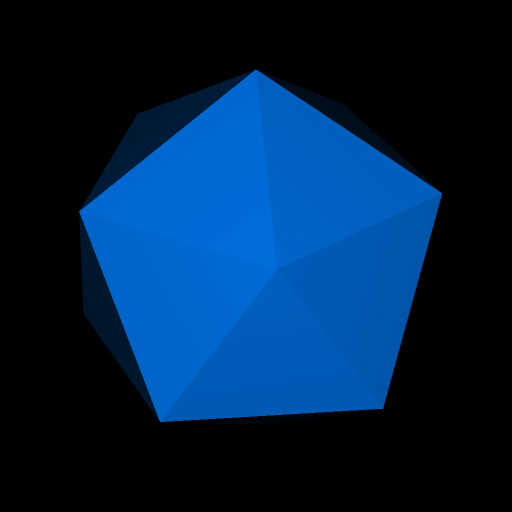icosahedron-vertex-down</a>

<a href="Imagine.Tests/input/cylinder-bounded.png" style="display: flex; align-items: center; gap: 10px; text-decoration: none;">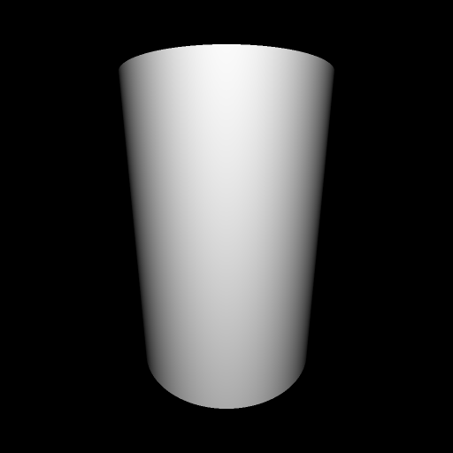cylinder-bounded</a>

<a href="Imagine.Tests/input/cone-bounded.png" style="display: flex; align-items: center; gap: 10px; text-decoration: none;">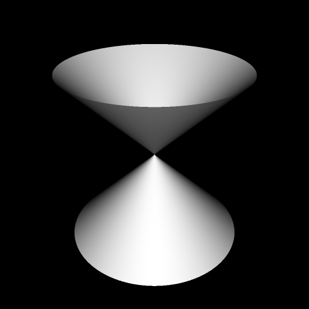cone-bounded</a>

<a href="Imagine.Tests/input/sphere.png" style="display: flex; align-items: center; gap: 10px; text-decoration: none;">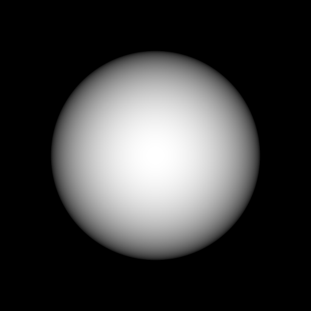sphere</a>

<a href="Imagine.Tests/input/cube-face-down-translated.png" style="display: flex; align-items: center; gap: 10px; text-decoration: none;">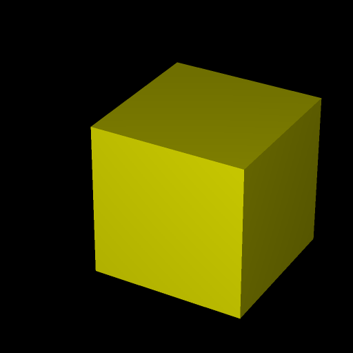cube-face-down-translated</a>

<a href="Imagine.Tests/input/cube-face-down-scaled.png" style="display: flex; align-items: center; gap: 10px; text-decoration: none;">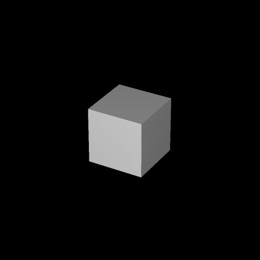cube-face-down-scaled</a>

<a href="Imagine.Tests/input/cube-face-down-rotated.png" style="display: flex; align-items: center; gap: 10px; text-decoration: none;">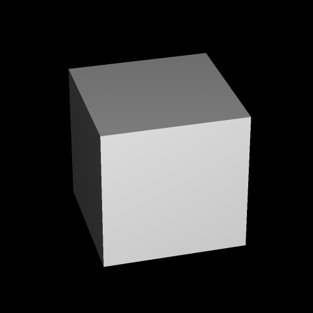cube-face-down-rotated</a>

<a href="Imagine.Tests/input/cube-face-down-sphere-union.png" style="display: flex; align-items: center; gap: 10px; text-decoration: none;">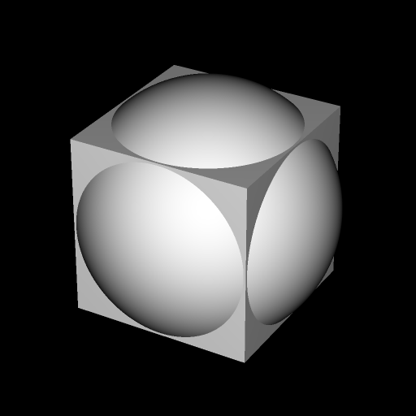cube-face-down-sphere-union</a>

<a href="Imagine.Tests/input/cube-face-down-sphere-intersection.png" style="display: flex; align-items: center; gap: 10px; text-decoration: none;">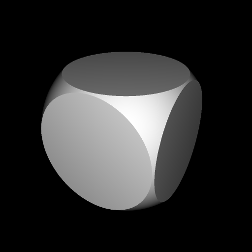cube-face-down-sphere-intersection</a>

<a href="Imagine.Tests/input/cube-face-down-sphere-inverted-union.png" style="display: flex; align-items: center; gap: 10px; text-decoration: none;">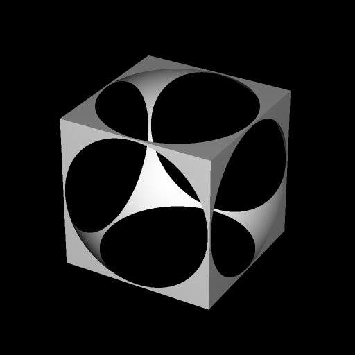cube-face-down-sphere-inverted-union</a>

<a href="Imagine.Tests/input/sphere-cube-face-down-inverted-intersection.png" style="display: flex; align-items: center; gap: 10px; text-decoration: none;">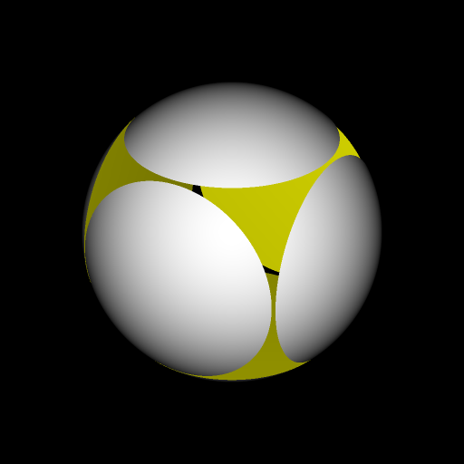sphere-cube-face-down-inverted-intersection</a>

<a href="Imagine.Tests/input/tetrahedron-union.png" style="display: flex; align-items: center; gap: 10px; text-decoration: none;">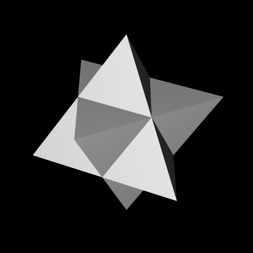tetrahedron-union</a>

<a href="Imagine.Tests/input/cube-face-down-octahedron-vertex-down-union.png" style="display: flex; align-items: center; gap: 10px; text-decoration: none;">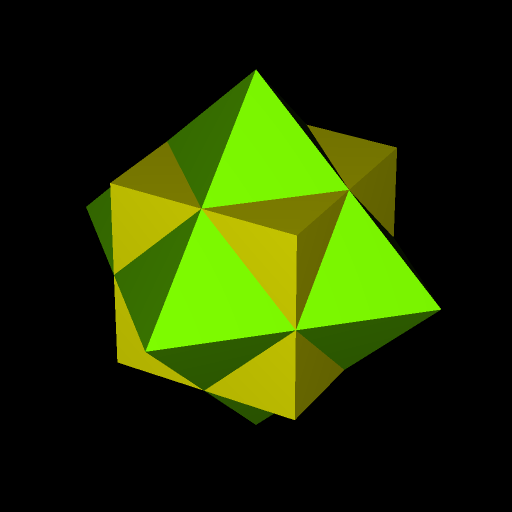cube-face-down-octahedron-vertex-down-union</a>

<a href="Imagine.Tests/input/octahedron-face-down-cube-vertex-down-union.png" style="display: flex; align-items: center; gap: 10px; text-decoration: none;">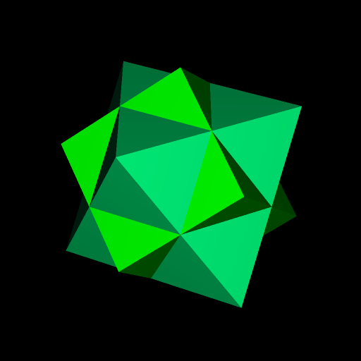octahedron-face-down-cube-vertex-down-union</a>

<a href="Imagine.Tests/input/dodecahedron-face-down-icosahedron-vertex-down-union.png" style="display: flex; align-items: center; gap: 10px; text-decoration: none;">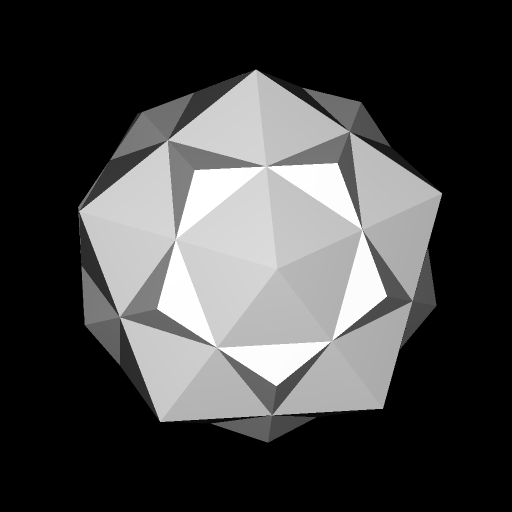dodecahedron-face-down-icosahedron-vertex-down-union</a>

<a href="Imagine.Tests/input/icosahedron-face-down-dodecahedron-vertex-down-union.png" style="display: flex; align-items: center; gap: 10px; text-decoration: none;">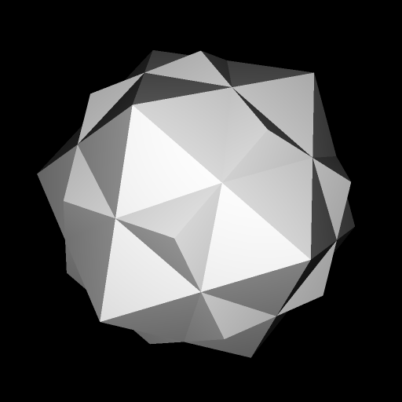icosahedron-face-down-dodecahedron-vertex-down-union</a>

<a href="Imagine.Tests/input/cylinder-intersection.png" style="display: flex; align-items: center; gap: 10px; text-decoration: none;">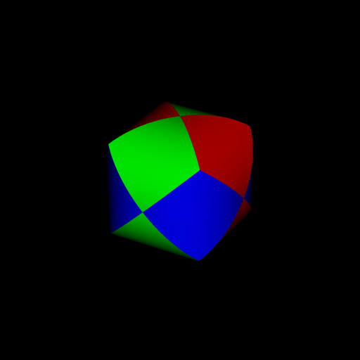cylinder-intersection</a>

<a href="Imagine.Tests/input/cylinder-union.png" style="display: flex; align-items: center; gap: 10px; text-decoration: none;">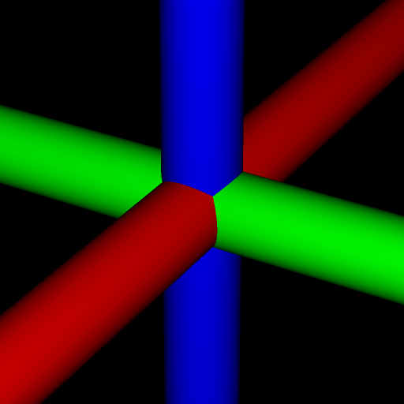cylinder-union</a>

<a href="Imagine.Tests/input/cone-union.png" style="display: flex; align-items: center; gap: 10px; text-decoration: none;">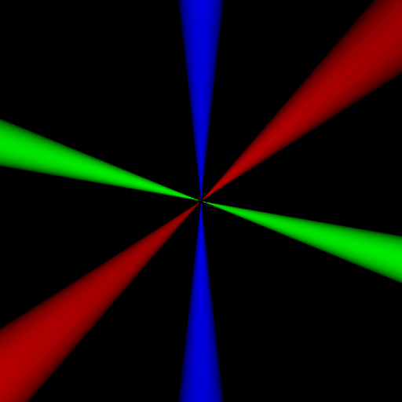cone-union</a>

<a href="Imagine.Tests/input/sphere-cone-inverted-intersection.png" style="display: flex; align-items: center; gap: 10px; text-decoration: none;">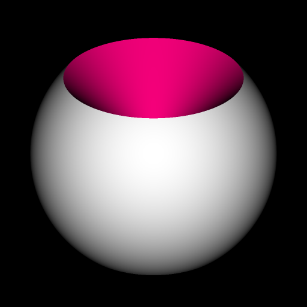sphere-cone-inverted-intersection</a>

<a href="Imagine.Tests/input/sphere-painted-rgb.png" style="display: flex; align-items: center; gap: 10px; text-decoration: none;">sphere-painted-rgb</a>

<a href="Imagine.Tests/input/sphere-painted-rgb-cartesian.png" style="display: flex; align-items: center; gap: 10px; text-decoration: none;">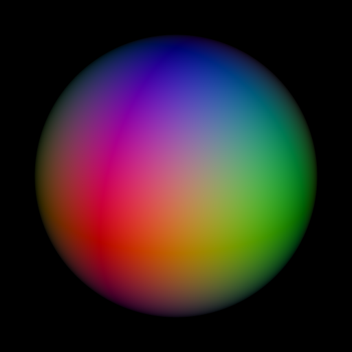sphere-painted-rgb-cartesian</a>

<a href="Imagine.Tests/input/sphere-painted-rgb-spherical.png" style="display: flex; align-items: center; gap: 10px; text-decoration: none;">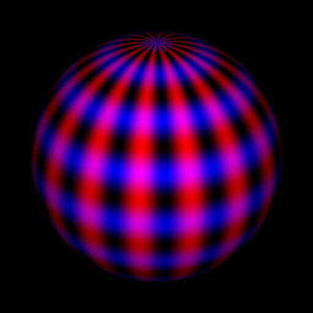sphere-painted-rgb-spherical</a>

<a href="Imagine.Tests/input/sphere-painted-hsv.png" style="display: flex; align-items: center; gap: 10px; text-decoration: none;">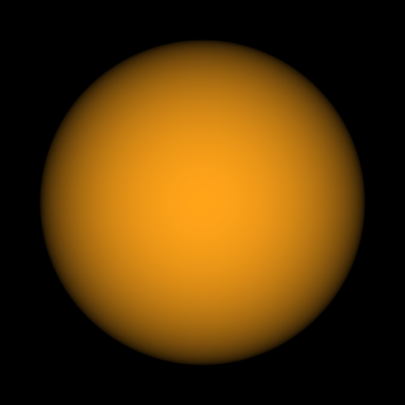sphere-painted-hsv</a>

<a href="Imagine.Tests/input/sphere-painted-hsv-cartesian.png" style="display: flex; align-items: center; gap: 10px; text-decoration: none;">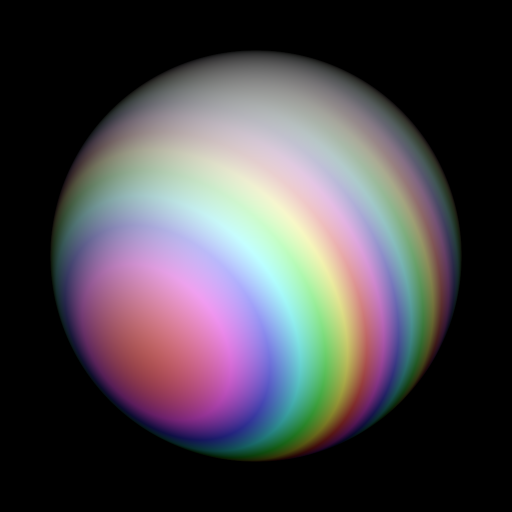sphere-painted-hsv-cartesian</a>

<a href="Imagine.Tests/input/sphere-painted-hsv-spherical.png" style="display: flex; align-items: center; gap: 10px; text-decoration: none;">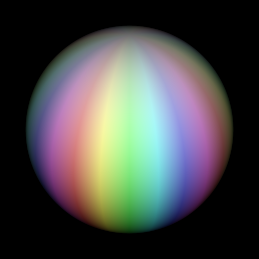sphere-painted-hsv-spherical</a>

### Movies

<a href="Imagine.Tests/input/rgb.mp4" style="display: flex; align-items: center; gap: 10px; text-decoration: none;">rgb</a>

<a href="Imagine.Tests/input/hsv.mp4" style="display: flex; align-items: center; gap: 10px; text-decoration: none;">hsv</a>

<a href="Imagine.Tests/input/cube-face-down-rotating.mp4" style="display: flex; align-items: center; gap: 10px; text-decoration: none;">cube-face-down-rotating</a>
